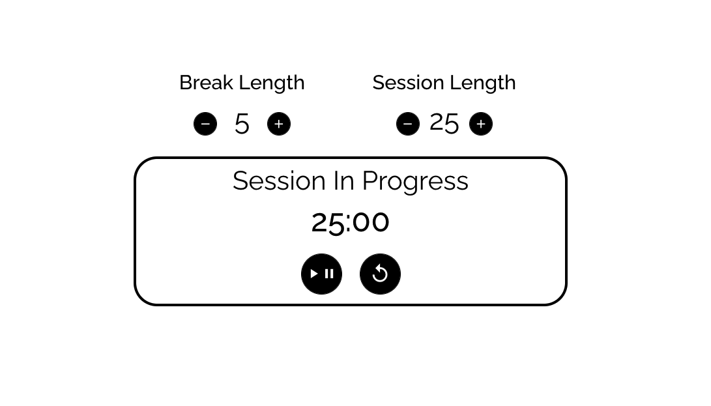
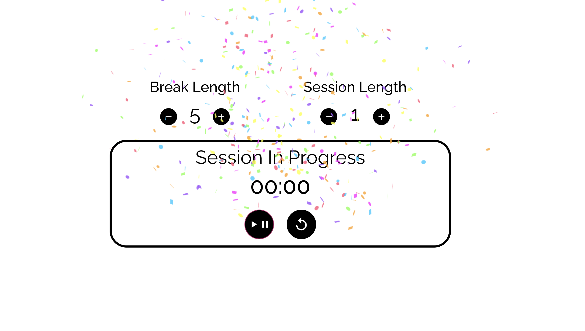
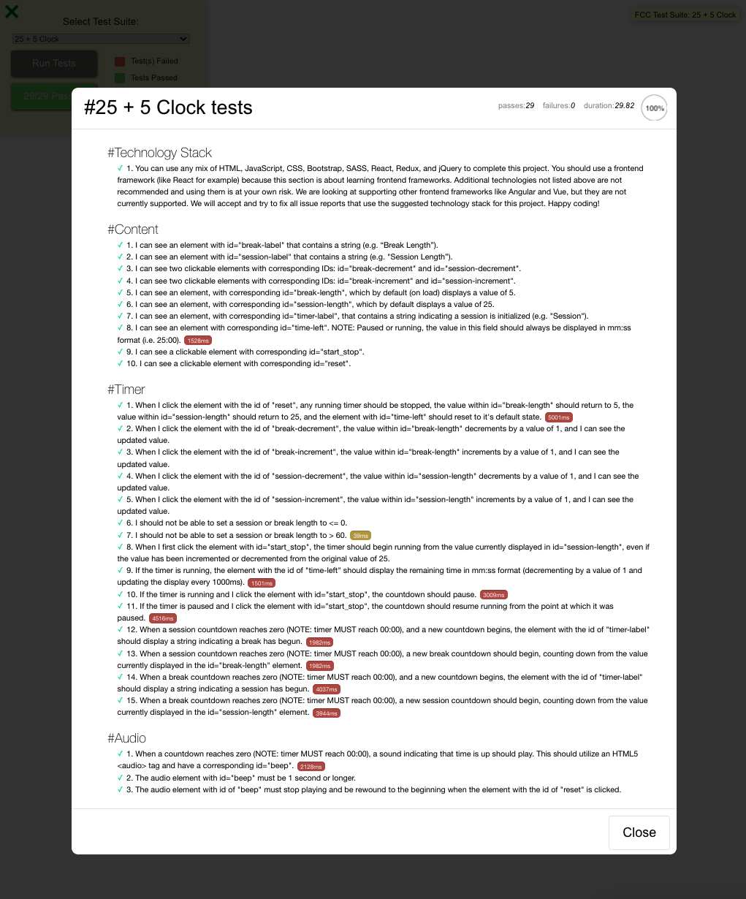

# 25 + 5 Clock

This project was created using React, Redux (using connect), HTML, CSS, and font awesome.

Deployed on github pages - [Check It Out](https://natalievasquez11.github.io/pomodoro-clock/)
Don't forget to choose "Javascript Calculator" in test suite when running tests!

## What it is

A pomodoro clock project from [freecodecamp's frontend certification](https://www.freecodecamp.org/learn/front-end-development-libraries/front-end-development-libraries-projects/build-a-25--5-clock). The calculator contains clickable elements that allow the calculator to perform mathematical operations. It also has a display to show the numbers being clicked and the result of the math operation.

## Freecodecamp's test results

Here is a screenshot of the test results from freecodecamp's test suite
